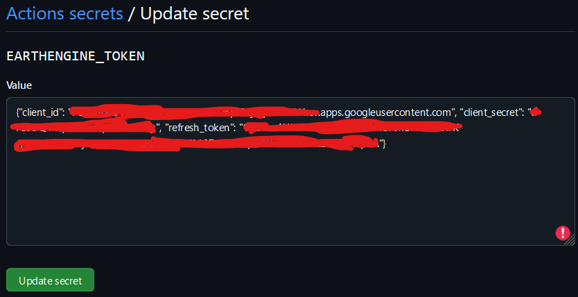

# Earth Engine API Testing with GitHub Actions

This project sets up a GitHub Actions workflow to test the installation and functionality of the Google Earth Engine API using `pip install earthengine-api`. It includes a simple test script (`test.py`) that initializes the API and retrieves the elevation of Mount Everest.

## Prerequisites

- **GitHub Account**: To host the repository and run GitHub Actions workflows.
- **Google Earth Engine Access**: You must have an active Earth Engine account.
- **Git**: For cloning the repository and pushing changes.
- **Earth Engine Python API**: Installed locally to generate credentials.

## Setup Steps

### 1. Clone the Repository

Clone the GitHub repository to your local machine:

```bash
git clone https://github.com/thekester/earthengine-api-test.git
cd earthengine-api-test
```

### 2. Create the Test Script

Create a file named `test.py` at the root of the project with the following content:

```python
import ee
import json
import os

# Load credentials from the environment variable
stored = json.loads(os.getenv("EARTHENGINE_TOKEN"))

# Write credentials to the appropriate Earth Engine credentials file
credentials_file = os.path.expanduser("~/.config/earthengine/credentials")
os.makedirs(os.path.dirname(credentials_file), exist_ok=True)  # Ensure the directory exists
with open(credentials_file, 'w') as f:
    json.dump(stored, f)

# Initialize the Earth Engine API
ee.Initialize()

# Print a greeting message from the Earth Engine servers
print(ee.String("Greetings from the Earth Engine servers!").getInfo())

# Test the API: Print the elevation of Mount Everest
dem = ee.Image('USGS/SRTMGL1_003')
xy = ee.Geometry.Point([86.9250, 27.9881])
elev = dem.sample(xy, 30).first().get('elevation').getInfo()
print('Mount Everest elevation (m):', elev)

# Verify that the elevation is a positive number
assert elev > 0, "Error: Elevation should be a positive number."

print("Test passed: The elevation of Mount Everest was retrieved successfully.")
```

### 3. Configure the GitHub Actions Workflow

In the `.github/workflows/` directory, create a file named `main.yml` with the following content:

```yaml
name: Test Earth Engine Script

on:
  workflow_dispatch:

jobs:
  test:
    runs-on: ubuntu-latest

    steps:
      - name: Checkout repository
        uses: actions/checkout@v4  # Use the latest stable version (v4)

      - name: Set up Python
        uses: actions/setup-python@v5
        with:
          python-version: '3.11'

      - name: Install dependencies
        run: |
          python -m pip install --upgrade pip
          pip install earthengine-api

      - name: Configure Earth Engine token
        env:
          EARTHENGINE_TOKEN: ${{ secrets.EARTHENGINE_TOKEN }}
        run: |
          mkdir -p ~/.config/earthengine
          echo "$EARTHENGINE_TOKEN" > ~/.config/earthengine/credentials

      - name: Run Earth Engine Script
        env:
          EARTHENGINE_TOKEN: ${{ secrets.EARTHENGINE_TOKEN }}
        run: |
          python test.py
```

### 4. Obtain Earth Engine Credentials

Generate the credentials file by authenticating locally:

```bash
earthengine authenticate
```

- Follow the instructions to authorize access.
- A credentials file will be created as `~/.config/earthengine/credentials`.

```python
import json

# Function to reformat the JSON
def reformat_json(input_file, output_file):
    # Read the JSON from the input file
    with open(input_file, 'r') as f:
        data = json.load(f)

    # Write the reformatted JSON to the output file
    with open(output_file, 'w') as f:
        json.dump(data, f, separators=(',', ':'), ensure_ascii=False)

# Specify the input and output file names
input_file = 'input.json'  # Replace with your input file name
output_file = 'output.json'  # Replace with your output file name

# Call the function to reformat the JSON
reformat_json(input_file, output_file)

print(f"The JSON has been reformatted and saved to '{output_file}'.")
```

```json
{
    "client_id": "yourclientid.apps.googleusercontent.com",
    "client_secret": "yourclientsecret",
    "refresh_token": "yourrefreshtoken",
    "project": "yourprojectid"
}
```

Pleas enote taht you can find the projectid on https://console.cloud.google.com/ it opens for example https://console.cloud.google.com/welcome?pli=1&project=ee-yourproject so here the projectid is ee-yourproject

Take the contnet of the generated output.json

```json
{"client_id":"yourclientid.apps.googleusercontent.com","client_secret":"yourclientsecret","refresh_token":"yourrefreshtoken","project":"yourprojectid"}
```

### 5. Set Up the GitHub Secret

To allow the workflow to access your credentials without exposing them:

1. Access your repository settings on GitHub.
2. Click on "Secrets and variables" in the sidebar, then "Actions".
3. Click on "New repository secret".
4. Name the secret `EARTHENGINE_TOKEN`.
6. Copy the entire content of the output.json and paste it into the value field of the secret.
8. Save the secret by clicking "Add secret".

Here’s an example image showing how to configure the secret in GitHub:



### 6. Commit and Push Changes

Add the files to version control, commit, and push to GitHub:

```bash
git add .
git commit -m "Configure Earth Engine API test with GitHub Actions"
git push origin main
```

### 7. Verify the Workflow Execution

- Go to the "Actions" tab of your repository on GitHub.
- You should see the workflow "Earth Engine API Test" running.
- Monitor the logs to ensure all steps complete successfully.
- Check the script output to confirm that the elevation of Mount Everest is correctly displayed.

## Important Notes

### Credential Security

- Never commit your credentials or secrets into the source code.
- Always use GitHub Secrets to store sensitive information securely.
- Do not share your credentials in public forums or repositories.

### Troubleshooting

- **Authentication Errors**: Verify that the `EARTHENGINE_TOKEN` secret is correctly configured and that the JSON is valid.
- **Dependency Issues**: Ensure that `earthengine-api` is installed correctly.
- **Permission Issues**: Check that your Earth Engine account has the necessary permissions.

## Additional Resources

- [Earth Engine API Documentation](https://developers.google.com/earth-engine)
- [GitHub Actions Documentation](https://docs.github.com/en/actions)
- [GitHub Secrets Management](https://docs.github.com/en/actions/security-guides/encrypted-secrets)

## Expected Output Example

If everything works correctly, you should see an output similar to the following in the workflow logs:

```yaml
Greetings from the Earth Engine servers!
Mount Everest elevation (m): 8729
Test passed: The elevation of Mount Everest was retrieved successfully.
```
